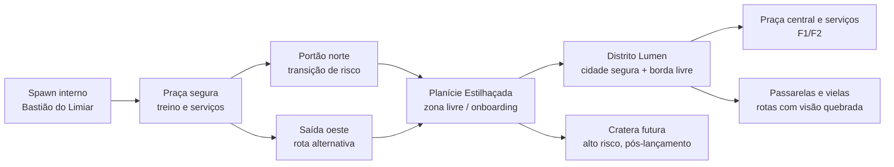

# Atlas Visual — Expansão de Domínio

**Projeto:** Anime Verse Battlegrounds  
**Estado:** conceito visual e planejamento de produção  
**Escopo:** Bastião do Limiar → Planície Estilhaçada → Distrito Lumen  
**Autor:** Manus AI  
**Data:** 2026-08-14

> Este documento é uma ilustração de direção de arte e composição de mundo. As imagens geradas por IA abaixo são referências originais de conceito; elas **não representam uma integração já realizada no Roblox Studio**, nem substituem o greybox, os volumes autoritativos, o streaming ou os gates W1/A1/R1/W2.

## 1. Visão geral

A expansão de domínio transforma o mapa inicial em uma sequência visual legível: o jogador começa no **Bastião do Limiar**, atravessa uma saída segura com aviso redundante, percorre a **Planície Estilhaçada** e avista o **Distrito Lumen** como primeiro grande destino urbano. A composição preserva as regras do planejamento: pelo menos duas saídas, rotas de retirada, fronteira de risco impossível de confundir com decoração, densidade antes de tamanho e expansão por células.

A imagem geral deve ser usada como **capa do planejamento de mundo**, referência para escala e revisão de identidade visual. Ela não deve ser importada como textura de terreno ou usada como mapa navegável.

## 2. Imagens e aplicação planejada

| Arquivo | Uso no projeto | Fase | Status |
|---|---|---:|---|
| `domain-expansion-concept.png` | Capa do atlas, escala entre Bastião, planície, fronteira e Distrito Lumen | F0 → F1/F2 | Referência original |
| `domain-expansion-district-lumen.png` | Direção de arte do primeiro centro urbano: ruas, vielas, passarelas, praça e marco vertical | F1/F2 | Referência original |
| `domain-expansion-safe-plaza.png` | Planejamento da praça coberta, spawn, treinamento, serviços e duas saídas do Bastião | F0 → F1 | Referência original |
| `domain-expansion-border-gate.png` | Especificação visual da transição segura/livre: portão, beacons, material de solo e rota de retorno | F0 | Referência original |
| `domain-expansion-modular-ruins.png` | Biblioteca conceitual de paredes, torres, pontes, plataformas, cristais e ruínas reutilizáveis | F1/F2 | Referência original |
| `domain-expansion-vfx-moodboard.png` | Direção de telegraphs, fronteiras, marcadores de rota, impactos e alertas de risco | F0 → F2 | Referência original |

### Distrito Lumen

Esta imagem define a linguagem de uma cidade densa sem exigir que a primeira implementação já seja uma cidade completa. O primeiro greybox deve conter uma rua principal, duas rotas laterais com linha de visão quebrada, uma praça, um marco vertical reconhecível e dois serviços. A verticalidade visual não deve virar verticalidade de combate antes de profiling de streaming, memória, câmera e gamepad.

### Praça segura

A praça serve como referência para o spawn e para a área de serviços do Bastião. O teto translúcido continua sendo visual e sem colisão, conforme `docs/22-SCENERY-EXPANSION.md`. A versão de produção deve preservar o espaço de treino sem dano, o Instrutor, o Marco de Retorno, o quadro de missões, a forja e duas saídas legíveis.

### Portão de transição

O portão é o componente mais importante para a leitura de risco. A implementação futura deve combinar forma física, mudança de material, iluminação, posts repetidos, UI, áudio e confirmação de entrada. A cor nunca deve ser o único sinal. Projéteis, áreas, empurrões e teletransportes hostis não podem atravessar a fronteira causando dano.

### Biblioteca modular

A imagem é uma referência de kit, não um atlas importável. Cada módulo futuro deve ser convertido em peça Roblox nativa ou modelo importado com escala, pivô, colisão, atributo de zona e orçamento de draw calls definidos. As peças não podem ocupar âncoras de NPC, volumes de transição ou corredores de combate sem uma regra explícita.

### Moodboard de VFX

O moodboard organiza a hierarquia visual dos efeitos: **ciano** para rotas e fronteiras, **violeta** para domínio e energia, **âmbar** para alerta e impacto. O objetivo é orientar futuras receitas de `EnemyVfxPlayer`, `AbilityVfxPlayer` e telegraphs de zona, sem copiar efeitos de franquias existentes e sem deixar partículas substituírem texto ou ícones de risco.

## 3. Mapa conceitual da expansão

O diagrama é estrutural: ele orienta zonas, rotas e dependências; não é uma planta final com escala. O Bastião e a Planície continuam sendo o escopo de F0. O Distrito Lumen é o primeiro alvo pós-F0 e só deve avançar depois dos gates de runtime e densidade.

## 4. Inventário visual recomendado

| Categoria | Referência externa gratuita | Uso recomendado | Condição |
|---|---|---|---|
| Rochas, grama e natureza | Kenney Nature Kit, CC0 [1] | Prototipar rochas, vegetação e bordas naturais | Importar/publicar no Studio antes de usar como referência de runtime |
| Modelos modulares e natureza | Quaternius, catálogo de assets gratuitos [2] | Avaliar kits de cidade, ruína, natureza e props | Confirmar licença do pacote específico antes de copiar para o repositório |
| Materiais e modelos PBR | Poly Haven, CC0 [3] | Texturas de pedra, solo, metal e referências de iluminação | Converter para um orçamento compatível com Roblox/mobile |
| Assets 3D low-poly | OpenGameArt CC0 [4] | Buscar alternativas e comparar estilo | Verificar a licença do item individual e registrar créditos |
| Imagens de conceito deste documento | Geradas por IA para este projeto | Direção de arte, moodboard, revisão de composição | Não tratar como asset jogável ou garantia de licença de modelo 3D |

## 5. Ordem de produção futura

A primeira etapa deve ser consolidar a praça coberta do Bastião e o portão norte usando peças nativas e os parâmetros já existentes em `SceneryPresentation`. A segunda deve produzir a rota oeste e o terreno externo da Planície sem alterar os volumes de zona. A terceira deve prototipar uma única célula do Distrito Lumen com uma rua, uma praça, dois serviços e duas rotas de saída. A quarta deve medir streaming, memória, render, física e legibilidade em PC integrado, Android e gamepad antes de duplicar módulos.

A expansão não deve começar por uma grande cidade completa. O critério correto é uma célula urbana pequena, densa e com função sistêmica. Se essa célula não sustentar rotas, serviços, leitura de risco e combate legível, a arte deve ser reduzida antes de ampliar o mapa.

## 6. Limites e não-alucinação

As imagens deste documento **não** provam que Distrito Lumen, seus serviços, passarelas ou ruínas já existem no jogo. Elas também não definem dimensões de hitbox, streaming, pathfinding, colisão, DataStore, telemetria ou desempenho. Toda integração futura precisa gerar código, testes, build e evidência de runtime separados.

Os assets externos citados são candidatos de pesquisa. A presença de um link ou imagem de referência não significa que o arquivo foi importado, publicado, licenciado por uma conta Roblox ou adicionado ao place. Para produção, cada modelo deve ter origem, licença, escala, colisão, triagem de segurança e custo registrados. O Kenney Nature Kit, neste repositório, tem **somente** `License.txt` e README — malhas não foram versionadas; o greybox continua nativo. Hashes das imagens deste atlas entram no inventário [`docs/assets/visual-inventory.json`](assets/visual-inventory.json). Usabilidade: [`docs/33-ASSET-USABILITY.md`](33-ASSET-USABILITY.md).

## Referências

[1]: https://kenney.nl/assets/nature-kit "Kenney Nature Kit — CC0"
[2]: https://quaternius.com/ "Quaternius — Free Game Assets"
[3]: https://polyhaven.com/ "Poly Haven — CC0 3D Asset Library"
[4]: https://opengameart.org/content/cc0-assets-3d-low-poly "OpenGameArt — CC0 Assets 3D Low Poly"
