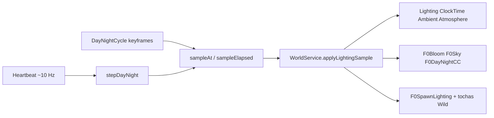

# 34 — Ciclo dia/noite F0

> **Estado em 2026-08-17:** implementado em dados puros + materialização server-side. Validação headless cobre o catálogo e o wiring; a beleza no Studio (amanhecer, golden hour, noite com tochas) permanece pendente de playtest visual.

## 1. Objetivo

Tirar a iluminação do crepúsculo fixo (`ClockTime 18.25`) e colocar um arco contínuo **amanhecer → dia → golden hour → crepúsculo → noite → meia-noite**, com:

- céu/atmosfera e color grading suaves;
- bloom mais presente à noite (leitura umbral/neon do Bastião);
- estrelas à noite;
- PointLights do spawn e tochas da planície **fortes à noite e discretas de dia**.

Não muda zona, combate, colisão, progresso nem assets externos (Gate P1 intacto).

## 2. Arquitetura

| Camada | Módulo | Papel |
|---|---|---|
| Dados puros | `src/shared/Data/DayNightCycle.luau` | keyframes, `hourAt`, `sampleAt`, `validate` — testável em Lune |
| Materialização | `WorldService` | `buildLighting` + `applyLightingSample` + `startDayNight` |
| Boot | `init.server.lua` | `DayNightCycle.validate()` fail-fast; injeta `dayNight`; `startDayNight(RunService)` |

O cliente **não** avança o relógio: o servidor é a autoridade. Lighting replica para todos.

## 3. Configuração (baseline)

| Parâmetro | Valor | Nota |
|---|---:|---|
| `cycleSeconds` | 600 | 10 min reais = 1 dia de jogo (bom para playtest) |
| `startHour` | 5.75 | começa no predawn → amanhecer nos primeiros minutos |
| `geographicLatitude` | 18 | caminho do sol um pouco “quente” |
| throttle | 0.1 s | ~10 Hz; lighting não precisa de 60 Hz |

### Keyframes

| id | hour | Intenção |
|---|---:|---|
| `midnight` | 0 | índigo profundo, estrelas, luz artificial alta |
| `predawn` | 5.0 | azul frio, estrelas minguando |
| `dawn` | 6.4 | rosa/âmbar — momento “bonito” |
| `morning` | 9.0 | ciano limpo |
| `noon` | 12.0 | máximo brilho, haze baixo |
| `afternoon` | 15.5 | levemente quente |
| `golden` | 17.4 | âmbar/magenta |
| `dusk` | 18.25 | herda o look fixo antigo do spawn |
| `twilight` | 19.6 | violeta umbral |
| `night` | 21.5 | noite anime, tochas dominam |

## 4. Efeitos em Lighting

| Objeto | Nome | Função |
|---|---|---|
| Atmosphere | `F0Atmosphere` | density/haze/glare + cores do sample |
| BloomEffect | `F0Bloom` | glow noturno sem estourar o dia |
| ColorCorrectionEffect | `F0DayNightCC` | grade global do ciclo (independente de `F0ZoneSignal`) |
| Sky | `F0Sky` | `StarCount`, sol/lua angulares |

Luzes artificiais gravam `AvbBaseBrightness` na criação; o ciclo multiplica por `artificialLightScale` (~0.18 ao meio-dia, ~1.45 à meia-noite).

## 5. Validação

| Gate | O que prova |
|---|---|
| `DayNightCycle.validate()` | orçamento, ordem, dia×noite, wrap do ciclo, crepúsculo 18.25 |
| `tests/animation.luau` | amostra noon/midnight/dusk/dawn + wiring WorldService/bootstrap |
| Studio (pendente) | leitura a olho: amanhecer, golden, noite com tochas, spawn legível |

## 6. Como ajustar no playtest

1. Acelerar para ver o arco em 2 min: `cycleSeconds = 120` (mínimo do validate).
2. Começar à noite: `startHour = 21.5`.
3. Voltar ao crepúsculo clássico fixo: não — prefira `startHour = 18.25` e deixe o ciclo andar, ou pause o Heartbeat em Studio se precisar freeze.

## 7. Referências

- [`docs/15-WORLD-PRESENTATION.md`](15-WORLD-PRESENTATION.md) — iluminação anterior (crepúsculo fixo)
- [`docs/28-SPAWN-VISUAL-PASS.md`](28-SPAWN-VISUAL-PASS.md) — luzes do spawn e orçamento Android
- [`src/shared/Data/DayNightCycle.luau`](../src/shared/Data/DayNightCycle.luau)
- [`src/server/Services/WorldService.luau`](../src/server/Services/WorldService.luau) — `applyLightingSample` / `startDayNight`
